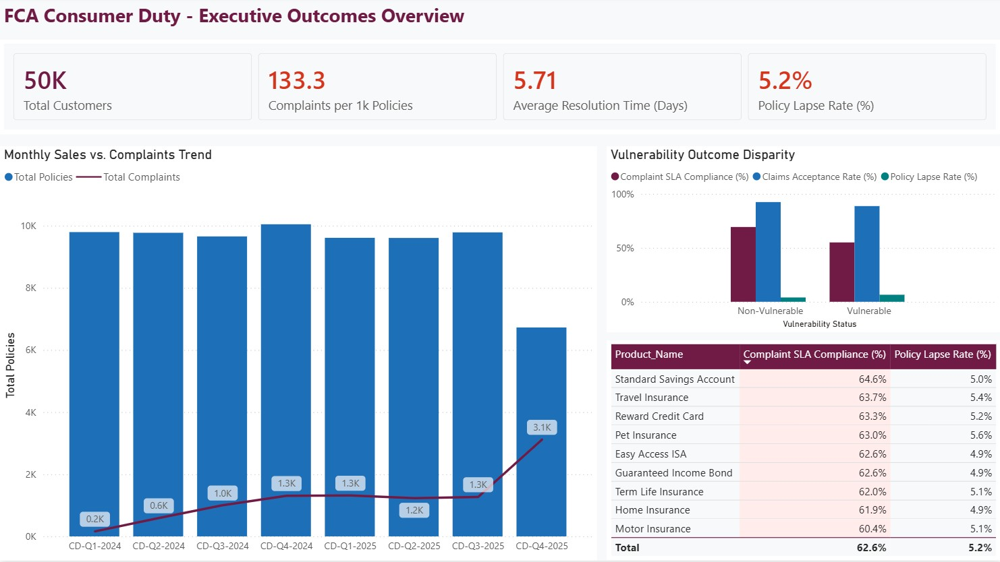
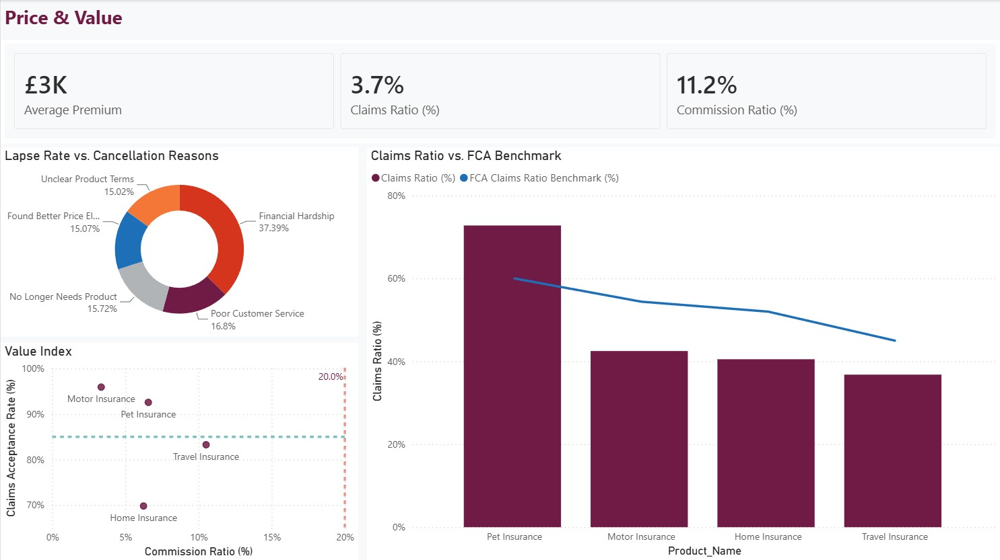
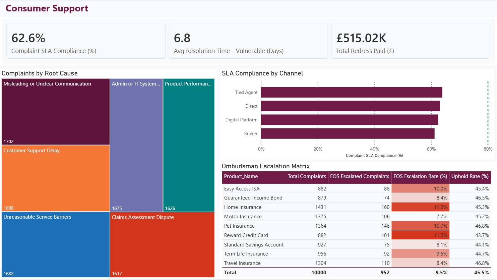
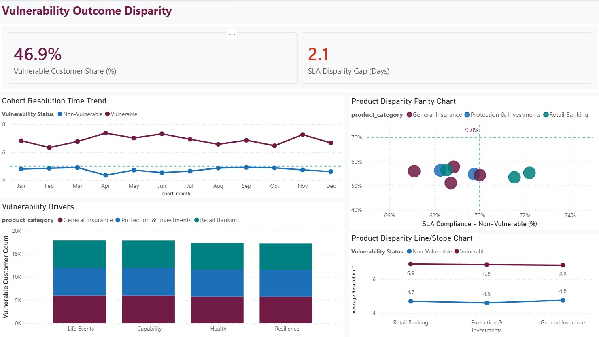

# FCA Consumer Duty Outcome Monitoring & Analytics Platform

[](https://www.python.org/)
[](https://www.sqlite.org/)
[](https://powerbi.microsoft.com/)
[](https://www.fca.org.uk/firms/consumer-duty)
[](tests/test_db.py)

---

## Executive Overview

This repository contains an end-to-end SQL, Python, and Power BI analytics solution designed for **FCA Consumer Duty Outcome Monitoring** in UK retail financial services. 

Enforced by the UK Financial Conduct Authority (FCA mandate **PS22/9 / FG22/5**), Consumer Duty requires firms to monitor, evidence, and demonstrate good outcomes across **four core outcome areas**:

1. **Products & Services**
2. **Price & Value**
3. **Consumer Support**
4. **Cross-Cutting: Vulnerable Customer Outcome Disparity**

Targeted at Heads of Conduct Risk, Product Governance, and Risk Committees, this platform processes **50,000 customer profiles**, **22 product lines**, **75,000 policy sales**, and **10,000 complaint records**, benchmarking internal portfolio performance directly against published FCA Value Measures and FOS ombudsman data.

---

## 📊 Power BI 4-Page Executive Dashboard Showcase

The Power BI dashboard is built using a custom **FCA Claret Theme** (`#701B45`) and follows UK enterprise governance standards.

### Page 1: Executive Outcomes Overview
Provides the Board and Risk Committee with a high-level summary of portfolio health, complaint rates, and vulnerability outcome disparities.



---

### Page 2: Price & Value (Fair Value Assessment)
Enables the Pricing & Product Governance Committee to evaluate product value, benchmarking internal claims ratios against published FCA GI Value Measures data.



---

### Page 3: Consumer Support (Complaints & Service Barriers)
Tracks operational response times, SLA compliance by distribution channel, root cause treemaps, and FOS ombudsman referral rates.



---

### Page 4: Vulnerability Outcome Disparity (Fair Treatment)
Dedicated 100% visual analytics page tracking whether vulnerable cohorts experience systematically worse operational outcomes across product categories and drivers.



---

## 🏛️ Data Strategy & Provenance Architecture

This project prioritizes **real UK public data** from regulatory and national statistics bodies:

```
+-----------------------------------------------------------------------------------+
|                            4-TIER DATA PROVENANCE HYBRID                           |
+-----------------------------------------------------------------------------------+
| Tier 1: Real Public Data (FCA Complaints H2 2025, FCA GI Value Measures 2024,      |
|          FOS Annual Complaints 2025/26, ONS Mid-2024 Demographics)               |
|                                                                                   |
| Tier 2: Calibrated Synthetic Data (50k Customer Profiles with Vulnerability Flags |
|          calibrated to ONS regional distributions and FCA incidence rates)         |
|                                                                                   |
| Tier 3: Analytical SQLite Star Schema (fact_complaints, fact_products,            |
|          dim_customer, dim_product, dim_calendar, dim_outcome_area)               |
|                                                                                   |
| Tier 4: Power BI Analytics Engine & DAX Measure Suite                             |
+-----------------------------------------------------------------------------------+
```

### Key UK Data Sources Used

| Dataset | Source Agency | File Location | Purpose |
| :--- | :--- | :--- | :--- |
| **FCA Firm Complaints 2025 H2** | Financial Conduct Authority | `data/raw/fca_firm_complaints_2025_h2.xlsx` | Industry complaint volume & redress benchmarks |
| **FCA GI Value Measures 2024** | Financial Conduct Authority | `data/raw/fca_gi_value_measures_2024.xlsx` | Claims ratios & acceptance rate benchmarks |
| **FOS Complaints 2025/26** | Financial Ombudsman Service | `data/raw/fos_complaints_2025_26.csv` | Ombudsman uphold rates by product category |
| **ONS Population Mid-2024** | Office for National Statistics | `data/raw/ons_population_england_wales_mid2024.xlsx` | Regional population demographic weights |

---

## 💻 Technical Architecture & Project Structure

```
c:\Projects\consumer-duty-analytics\
├── data/
│   ├── raw/                 # Real downloaded FCA, FOS, and ONS datasets
│   └── processed/           # SQLite database (consumer_duty.db)
├── powerbi/
│   ├── Consumer_Duty_Analytics.pbix  # Power BI Desktop report
│   ├── fca_consumer_duty_theme.json  # Official FCA color palette theme
│   ├── Page1.jpg            # Screenshot: Executive Overview
│   ├── Page2.jpg            # Screenshot: Price & Value
│   ├── Page3.jpg            # Screenshot: Consumer Support
│   └── Page4.jpg            # Screenshot: Vulnerability Disparity
├── queries/
│   ├── products_services.sql
│   ├── price_value.sql
│   ├── consumer_support.sql
│   └── vulnerability_disparity.sql
├── reports/
│   ├── executive_briefing.md      # C-Suite Executive Summary
│   ├── powerbi_dashboard_design.md# Full 4-page dashboard design specs
│   └── dax_measures.md           # Official DAX Measure Catalog
├── scripts/
│   ├── config.py             # Product taxonomies & KPI thresholds
│   ├── utils.py              # DB connection & logging utilities
│   ├── fetch_fca_benchmarks.py# FCA data downloader
│   ├── fetch_fos_data.py     # FOS data downloader
│   ├── fetch_ons_data.py     # ONS data downloader
│   ├── ingest_to_sqlite.py   # Raw staging ingestion
│   └── build_star_schema.py  # Star schema generator
├── tests/
│   └── test_db.py            # pytest database verification suite
├── PROJECT_CAPSULE.md        # Handover documentation
├── README.md                 # Project documentation
└── requirements.txt
```

---

## 📈 Core DAX Measures & Regulatory Definitions

All DAX formulas avoid formatting type-conversion errors and reside in [reports/dax_measures.md](reports/dax_measures.md):

* **Complaint SLA Compliance (%)**:
  $$\text{DIVIDE}(\text{CALCULATE}([\text{Total Complaints}], \text{days\_to\_resolve} \le 5), [\text{Total Complaints}], 0)$$
* **Claims Ratio (%)**:
  $$\text{DIVIDE}(\text{SUM}(\text{claims\_paid\_amount}), \text{SUM}(\text{premium\_or\_fee}), 0)$$
* **SLA Disparity Gap (Days)**:
  $$\text{Avg Resolution Time (Vulnerable)} - \text{Avg Resolution Time (Non-Vulnerable)}$$

---

## ⚙️ Quickstart & Local Setup

### 1. Prerequisites
* Python 3.10+
* Power BI Desktop (for opening `.pbix`)

### 2. Installation & Database Building

```bash
# Clone repository
git clone https://github.com/WarWolf95/consumer-duty-analytics.git
cd consumer-duty-analytics

# Create and activate virtual environment
python -m venv venv
venv\Scripts\activate  # Windows

# Install dependencies
pip install -r requirements.txt

# Run full ETL & Star Schema Database Builder
python -m scripts.build_star_schema

# Execute Automated Test Suite
python -m pytest
```

---

## 📜 Regulatory Reference & Compliance
* **FCA Consumer Duty Policy Statement**: [PS22/9 (July 2022)](https://www.fca.org.uk/publication/policy/ps22-9.pdf)
* **FCA Final Non-Handbook Guidance**: [FG22/5 (July 2022)](https://www.fca.org.uk/publication/finalised-guidance/fg22-5.pdf)
